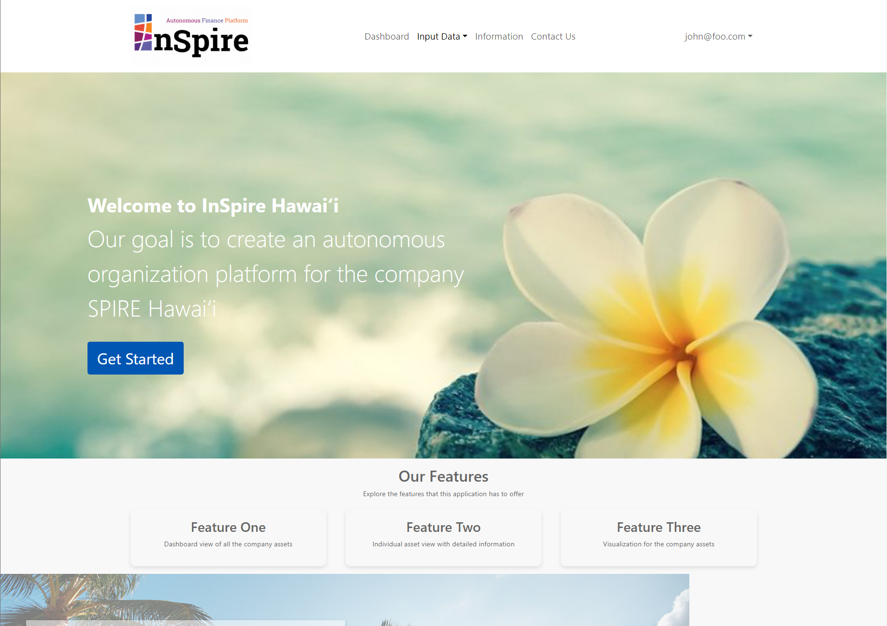

For the uninitiated, ICS 414 (Software Engineering II) builds upon ICS 314 but focuses on one major project that teams work on throughout the semester. While 314 was challenging at times, I loved how it pushed me to become a better developer, which is partly why I enrolled in 414 the following semester. Our team's mission was to create a Meteor-based application for financial projections, using calculations provided by our client. 

## Stepping Up
I was mostly responsible with writing Initially, both my teammates and I struggled to understand the client's specific requirements. We had to review the client-provided documents and spreadsheets multiple times to grasp the project's goals and scope. During this period, I realized I needed to take on a larger project management role, despite my limited experience. This wasn't assigned to me, nor was it something I actively sought. However, it became evident that to meet our milestone deadlines, we needed to break down the project into manageable components that would allow all team members to contribute effectively.

## Data Structures and Databases
It's frustrating when a talented front-end developer can't contribute because of unresolved backend issues. We faced this challenge early on due to the lack of a functioning database collection. When team members created their own database schemas, it led to file bloat and our main branch became cluttered with partially working collections. I eventually took the initiative to clean up our main branch by studying the Meteor template documentation and rebuilding from scratch. This effort streamlined our development process and made it easier to assign tasks to team members. It also clarified how the backend worked, enabling others to tackle additional challenges independently. The lesson learned: always consult the documentation!

## Team Communication
ICS 314 taught me the value of maintaining clear, consistent team communication. In 414, this became even more crucial as many students opted not to attend class. Whether through Discord calls or other means, regular meetings were essential for keeping everyone aligned and aware of deadlines. Sometimes, all it takes is someone willing to take the first step rather than waiting for others to act. While scheduling a team meeting through Discord might seem trivial, it's a crucial step that significantly impacts project progress.

## Adapting to Client Needs
The motto "the customer is always right" proved relevant in unexpected ways. Client milestone meetings provided valuable insights into how they perceived our application's progress. By carefully observing their reactions to both our work and other teams' presentations, we gained a better understanding of their preferences. For instance, we initially focused on creating a user-friendly interface that differed from their existing spreadsheet. However, when another team presented a spreadsheet-like input page, the client responded enthusiastically. This feedback prompted us to redesign our user input pages, even though it meant postponing other planned features. Remember: you're developing an application for the client, not yourself. Staying attentive to their feedback and asking clarifying questions helps ensure the final product aligns with their vision.

## Final Thoughts
The ICS 414 project deepened my understanding of software development processes. While frustrating at times, these challenges are inherent to the field. The course taught me to anticipate imperfect situations and, more importantly, how to address them effectively. Additionally, it helped me become more comfortable taking charge when necessary. Though I never considered myself a leader, this experience honestly helped me recognize and develop my leadership potential, not just in an engineering context, but also in my everyday life.
