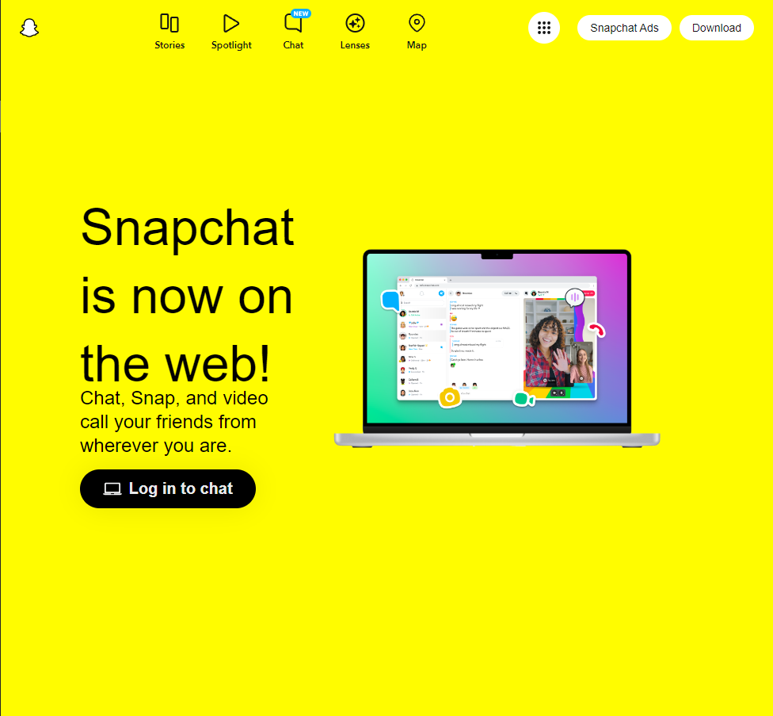

## Introducing Bootstrap 5!

  
  
 

I really had no previous experience with UI Frameworks prior to this week, and I wish I had! Going from Javascript and jumping into Bootstrap 5 is as polarizing as learning a new programming language. You have to shift your entire approach and tackle it in different ways, I found. You can spend hours literally wondering why your img isn't centered and it WILL drive you insane. With Javascript, at least, I ususally understood why my code was wrong. In Bootstrap 5, however, I'd run into situations where I'd feel like my webpage should look a certain way but simply refuses to cooperate. Of course, I'd always remedy the problem, but it was still frustrating nonetheless. 

## It's never as easy as it seems...
It's easy to say "Hey Cash, make a dropdown menu and left align this jpeg," but you will learn the implications of actually doing it. It "should" be easy to center 4-5 icons on a navigation bar and have text under each icon, but sadly we don't live in that world. This is precisely what I had to do for my assignment. You'll see in the images above that I chose to replicate the Snapchat home page, relatively simple in appearance (the left picture). The picture aside it is my replication. In my head, I had an idea of how I'd get through each section. But then I realized that I had to figure out how to download their proprietary icons that aren't generic enough to be found in Bootstrap. Then I had to figure out why they weren't centering. But lastly, I had to figure out how to put labels underneath each icon. That alone took up several hours. Instantly, I realized I needed at least another 4 hours to make my replication pixel perfect. 
