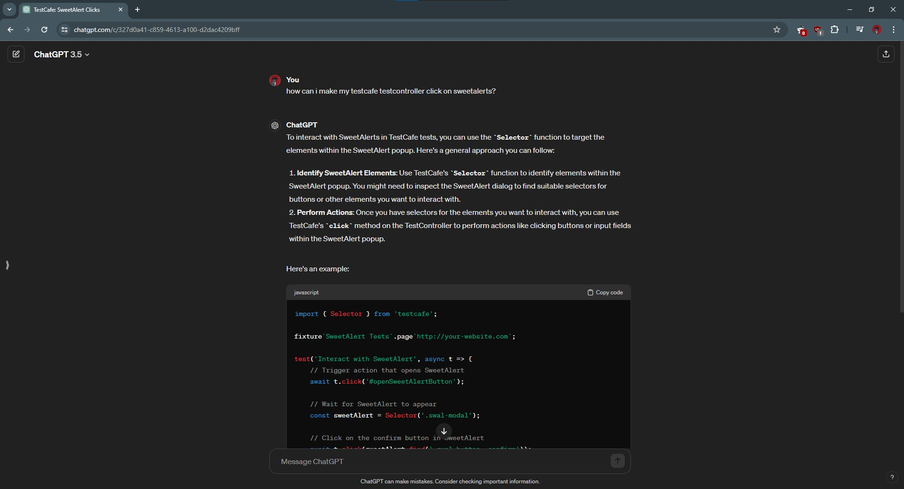

### I. Introduction
Software engineering is a field that can be very overwhelming to many students, myself included. As someone who grapples with their ADHD on a daily basis, I still struggle with wrapping my head around numerous concepts and digesting tons of information in a timely fashion. Supplementing my learning experience with AI has been able to help me learn more quickly and easily. The specific tools I used during this semester is ChatGPT (versions 3.5 & 4).

### II. Personal Experience with AI:
I have used AI in class this semester in the following areas:

1. Experience WODs e.g. E18
 
I did not use AI for the experience WODs, since these WODs are usually provided with detailed instructions or video explanations.
2. In-class Practice WODs
 
On a few occasions I've used AI to help me with the practice WODs. AI would be particularly helpful when I'd run out of time and wanted to finish a practice WOD after class (assuming an answer key isn't provided).
3. In-class WODs
 
There were a few class WODs that would utilize AI. For example, I had issues figuring out why elements of my application weren't properly centered, so I would copy and paste my code into ChatGPT and enter a prompt asking for revisions to possibly fix my issues. However in that specific instance, it was not able to fix my code. AI was more useful when I needed to generate a simple algorithm or function. Sometimes the instructions for writing a function would be unclear to me, so I'd copy and paste part of the WOD instructions and add other details to the prompt I'd put into ChatGPT.  
4. Essays
 
AI was usually only useful for me when I wanted to learn specific details about a subject that I'm writing about. For example, in my "Perfecting Spaghetti" essay, I looked up characteristics pertaining to specific design patterns I was writing about, but only used AI in a supplementary capacity. I also used AI to proofread my essays. 
5. Final project
 
ChatGPT was incredibly useful when working on my final project. If I had a quick question (e.g. how to remove table row lines, how to query for a specific item in a collection) I'd type in my question and include my code, seeing what code revisions it makes. Doing this was often faster than typing my question into Google and browsing StackOverflow questions. 
6. Learning a concept / tutorial
 
If the professor provided answers for an in-class WOD and there were code elements I did not understand, AI would help me figure out and explain specific parts of a function or explain a code's syntax.  
7. Answering a question in class or in Discord
 
I did not use AI for answering questions, simply because I can't recall a situation where I felt like I needed AI to answer a question in Discord or in class. 
8. Asking or answering a smart-question
 
Usually if someone is working on the same assignment as me, I'm able to simply compare my code with theres and spot any differences or errors they have, so I rarely used AI to answer smart questions.
9. Coding example e.g. “give an example of using Underscore .pluck”
 
AI helped me in particular with providing coding examples for Underscore functions. The Underscore website did not provide examples I could understand and there were several ways to call an Underscore function, so using AI was helpful in teaching concepts. One prompt I used was "Use _.every to implement a function called allBig that accepts a list of objects and returns true if the value of every num field in the list is greater than 100."
10. Explaining code
 
Similar to #6, AI was very helpful when I needed to understand specific code syntax or how a specific function worked. 
11. Writing code
 
There would be times when I needed to write an implementation or had a partially written implementation and did not know how to move forward. For example, I had a file that was calling to a collection to give points to users, but did not know how to call to the collection, so AI would fill in the blanks in my code. It would point me in the right direction and would inform me on how to write the rest of my code, but I'd rarely copy the code verbatim.
12. Documenting code
 
I found it more useful and faster to document code myself rather than use AI, so I rarely used AI in this case. 
13. Quality assurance
 
If my code had no errors but was not giving me the desired output, I'd copy and paste my code and explain that my code isn't acting as intended. This would usually give me a few potential parts of the code 
14. Other uses in ICS 314 not listed above
 
I did not use AI in other ways for the class.

### III. Impact on Learning and Understanding:
AI was a very helpful tool for teaching and understanding new concepts. I can understand something on a conceptual level, but AI was great for giving practical applications and examples to further my comprehension of many software engineering concepts.

### IV. Practical Applications:
AI has a multitude of practical, real-world applications. For instance, Ansys has been exploring the use of AI to improve the speed and accuracy of simulations. AI also has practical use when needing to automate processes, which has helped cybersecurity companies deploy solutions faster. 

### V. Challenges and Opportunities:
The answers AI provides are often only as good as the prompt provided. If you can't figure out how to write your prompts in a specific way, it can spit out unhelpful answers. Even if I write out a prompt adequately, sometimes I would need to add other specifiers to my prompt. And sometimes AI can provide answers that aren't applicable to your current implementation.

### VI. Comparative Analysis:
Many of the weaknesses that come with traditional teaching methods can be addressed by AI. Traditional teaching methods involve highly structured lectures that aren't as engaging to some students. If students aren't engages, they won't be able to retain information as easily. AI can provide more personalized learning experiences and increase overall engagement. However, the level of success and good outcomes is highly dependent on the implementation. Being able to strike a balance between traditional teaching methods and AI approaches, rather than relying on one methodology, would be the best approach.

### VII. Future Considerations:
AI can be a great tool to personally tailor educational content for students with specified needs, freeing up time for teachers or TAs. AI could also be used for data analytics, identifying areas that students may need more support in.

### VIII. Conclusion:
Being able to use AI this semester has, without a doubt, enhanced my learning experience in numerous ways. I can learn and digest the same amount of information, but in a way that takes less time and can work around my specific learning styles, all without needing to talk to another person and take up their time. It works best when it optimizes your learning style, rather than depend on it wholly, so emphasizing this to students is my main suggestion for future courses.