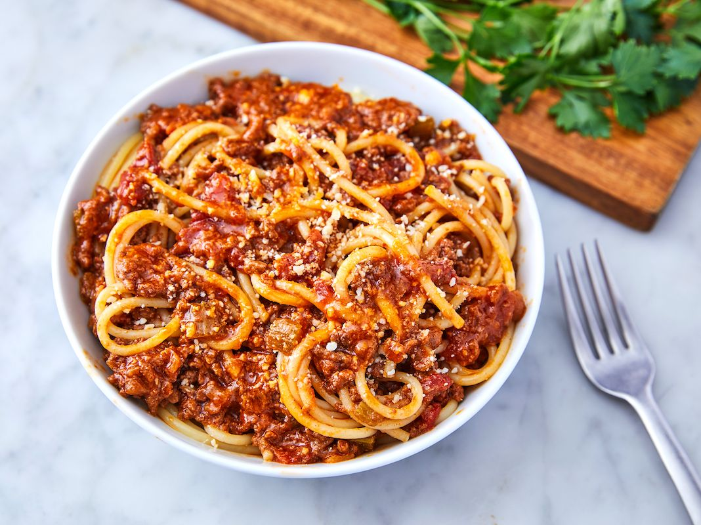

  

 

## Reaching Perfection
Sometime last year, I took an initiative to try and cook my own meals, rather than relying on frozen dinners or fast food. I did this partly out of necessity (I was broke) but also because I was deeply depressed at the time. I had to take a leave of absence from school which pushed back my target graduation date, while simultaneously being unemployed and still living with my mom. Looking back at where I was then, cooking my own meals was a gratifying process that offered a decent respite from my totally rad existential crisis. But it required some trial and error to figure out how to perfect a specific meal I had in mind. When I made spaghetti the first time around, it was admittedly pretty meddling. Not bad but not great, that wasn't good enough. So naturally I'd periodically ask my mom how to improve it and she'd offer some great tips. If I said the sauce was too sweet, for example, she'd list off a few ingredients that could offset the sweetness a bit more, some working better than others. Sometimes the noodles would be too soft, which I resolved by boiling the pasta a few minutes under what the box instructed (a helpful trick I learned from watching Marco Pierre White cooking videos). Finally, I was able to take all these helpful concepts and construct a bowl of spaghetti that was exponentially superior in quality compared to what I initially made. These may have been just simple tips and techniques, but they also could be transferred and applied to other dishes I'd try to make. 

## Back to programming
Similar to the cooking techniques I learned, Design patterns offer a general solution to a recurring problem programmers face. Having a protein or meat overcooked and burnt on the outside and practically still breathing on the inside is a commonly issue amateur home cooks face, which can be remedied by cooking with a food thermometer. Food thermometers are consistent and can be used for various types of meats and proteins, but requires the thermometer to be regularly cleaned and the time spent checking the temperature can extend your overall cooking time, requiring you to weigh the benefits and drawbacks first. In a similar vein, needing to provide a global variable is a commonly recurring problem that programmers face when working with languages that don't natively support global variables or global variable states. The Singleton design pattern tries to solve this by creating a class that can only have one existing instance. As with the food thermometer, the Singleton design pattern comes with various benefits and drawbacks. It provides a globally accessible class that's easily implemented with lazy initialization (the instance is created upon its first request), saving on memory and resources. However, Singleton classes are harder to extend and modify. Additionally, Singletons introduce a global state, which can introduce additional issues with testability. 

## My Personal Experiences 
A few days prior to writing this, I admittedly had no idea what a design pattern even was, but I was unknowingly learning about and implementing them all throughout the semester, namely the Observer design pattern. The problem: A set of objects or "observers" need to be informed of a state change to another object, the "subject." In an Observer design pattern, the subject maintains a collection of observers and notifies them upon a state change, with observers designated as "listeners" or "subscribers", including a update mechanism that notifies observers of the state change. In my group project, my teammates and I needed to create a program that let users submit and track lost and found items. Using this design pattern, our program could let users add items marked as lost or found, which added them to their respective collection. The lost items page, for instance, contained a subscription to the lost item collection so the page could display the items and any potential changes made down to each individual item. 

## In conclusion...
Much like the cooking tips I received, design patterns helped me feel comfortable as a beginner when encountering issues. They served as good starting points when tackling challenges and even if they aren't universally helpful or practical 100% of the time, they've help me make more informed choices, whether its about implementing a simple mechanism to notify state changes, or making a **_pretty neat_** bolognese sauce.
