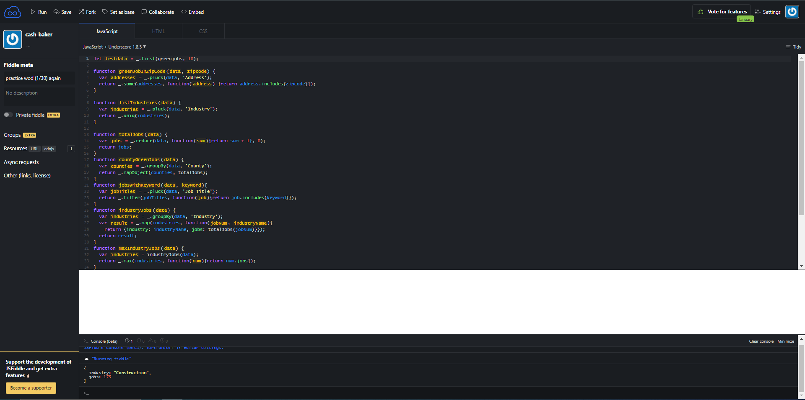
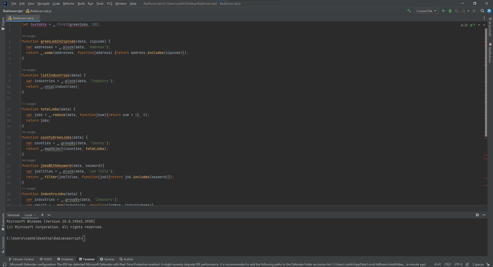

   
  

 

## Don't forget to dot your i's and insert your newLines!
I may be in the minority, but having ESLint supplement IntelliJ makes my coding experience significantly more valuable and maybe even satisfying. I enjoy knowing exactly where and what my mistakes are because of how errors are handled. Most errors have a label, which corresponds with a web page to teach you about a specific coding standard. It can also fix errors in many cases, but I usually choose to hand fix them. Some may be annoyed by having to pay attention to the minute details, like ensuring your program ends in a new line, but I feel it's necessary when learning concepts where the minute details matter. After a few hours, I quickly got a good feel for abiding by the ESLint standards. It's gotten to a point where I can recognize what error I have seconds after I see redlines underneath my lines of code. Coding standards generally speaking can improve overall readability and collaboration with other developers, and I'd imagine this also benefits the TA's having to grade these assignments if they're all abiding by the same coding standards. And you know what.. I do enjoy that green check. I'll live and die by the green check. Maybe it's psychosis.

## Hopes for the future
Overall, I'm in a much better position compared to last year. I've talked before about the importance of retaining concepts vs retaining answers and so far it's been paying off. And if I still have blindspots in my coding knowledge, ESLint and IntelliJ helps pick me back up. When writing out a underscore function, for instance, you're greeted with the function syntax and parameter definitions, which were especially helpful to me. I'm far from the best programmer, but I'm confidant that my current tool set will aid greatly in raising my own personal standards.
