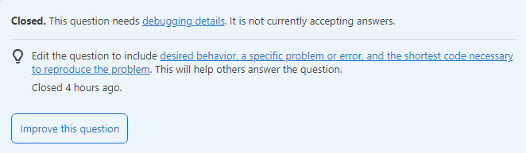

At some point, every programmer has been in a position where they felt like they hit a brick wall in their code. They tried googling solutions but are left with more questions than answers. There's no shame in asking for help and asking questions yourself. Asking questions fosters a healthy learning environment and should always be encouraged. But as we'll see, the quality of a question greatly affects the quality of the answers you receive.   

## What makes a question "smart"?

A "smart question" should adequately provide a snapshot of the problem you've encountered. [Let's take this question for example.](https://stackoverflow.com/questions/32370994/how-to-pass-props-to-this-props-children)

```
Q: How to pass props to {this.props.children} 
I'm trying to find the proper way to define some components which could be used in a generic way:

<Parent>
  <Child value="1">
  <Child value="2">
</Parent>

There is a logic going on for rendering between parent and children components of course, you can imagine <select> and <option> as an example of this logic.

This is a dummy implementation for the purpose of the question:

var Parent = React.createClass({
  doSomething: function(value) {
  },
  render: function() {
    return (<div>{this.props.children}</div>);
  }
});

var Child = React.createClass({
  onClick: function() {
    this.props.doSomething(this.props.value); // doSomething is undefined
  },
  render: function() {
    return (<div onClick={this.onClick}></div>);
  }
});

The question is whenever you use {this.props.children} to define a wrapper component, how do you pass down some property to all its children?

```

What makes this a great question? Let's start with the title. "How to pass props to {this.props.children}" No glaring grammatical errors, just a brief sentence that communicates what is needed. A title like this can draw eyes from other users who may have a similar question (which might explain why the question has 951k+ views as of 1/25/24). Even though the user isn't referencing actual code, they took the time to write out an implementation to better communicate their question. The post ends with a reiteration of the question, referencing the implementation. In response, not only do we get plenty of different answers (32 responses), but we also find answers that are clear and precise. 

```
A: 
Cloning children with new props
You can use React.Children to iterate over the children, and then clone each element with new props (shallow merged) using React.cloneElement.

See the code comment why I don't recommend this approach.

Using cloneElement is uncommon and can lead to fragile code. See common alternatives. source: react.dev

const Child = ({ childName, sayHello }) => (
  <button onClick={() => sayHello(childName)}>{childName}</button>
);

function Parent({ children }) {
  // We pass this `sayHello` function into the child elements.
  function sayHello(childName) {
    console.log(`Hello from ${childName} the child`);
  }

  const childrenWithProps = React.Children.map(children, child => {
    // Checking isValidElement is the safe way and avoids a
    // typescript error too.
    if (React.isValidElement(child)) {
      return React.cloneElement(child, { sayHello });
    }
    return child;
  });

  return <div>{childrenWithProps}</div>
}

function App() {
  // This approach is less type-safe and Typescript friendly since it
  // looks like you're trying to render `Child` without `sayHello`.
  // It's also confusing to readers of this code.
  return (
    <Parent>
      <Child childName="Billy" />
      <Child childName="Bob" />
    </Parent>
  );
}

ReactDOM.render(<App />, document.getElementById("container"));

Alternatively, you can pass props to children via render props. In this approach, the children (which can be children or any other prop name) is a function which can accept any arguments you want to pass and returns the actual children:

const Child = ({ childName, sayHello }) => (
  <button onClick={() => sayHello(childName)}>{childName}</button>
);

function Parent({ children }) {
  function sayHello(childName) {
    console.log(`Hello from ${childName} the child`);
  }

  // `children` of Parent must be a function
  // which returns the actual children. We can pass
  // it args to then pass into them as props (in this
  // case we pass `sayHello`).
  return <div>{children(sayHello)}</div>
}

function App() {
  // sayHello is the arg we passed in Parent, which
  // we now pass through to Child.
  return (
    <Parent>
      {(sayHello) => (
        <>
          <Child childName="Billy" sayHello={sayHello} />
          <Child childName="Bob" sayHello={sayHello} />
        </>
      )}
    </Parent>
  );
}

ReactDOM.render(<App />, document.getElementById("container"));

``` 
The responder was able to communicate multiple approaches, explain the pros and cons of each broadly, and writes examples using the original dummy implementation as a reference. Clear readable questions give clear readable answers. The answer was not only helped the original poster, but also the hundreds of thousands of other people who saw the post hoping for a solution. These types of exchanges create amazing positive learning outcomes. 

## ..and not smart
However, not all questions are born equal.
Sometimes in life, we need to stop to ask ourselves.. [will eclipse no run classes?](https://stackoverflow.com/questions/77883350/will-eclipse-no-run-classes)

```
Q: Will eclipse no run classes? (-1 rating) 

I try to run my class and it says the selection cannot be launched, and there are no recent launches.

I tried to run it and I expected it to run but it just pops up with "the selection cannot be launched, and there are no recent launches."
```

There's a lot to unpack here. To start, the post title isn't grammatically sound and worded confusingly. They start by asking if Eclipse can launch classes but they're not looking for a simple yes or no answer, they're really asking why their class isn't launching which isn't communicated in the title. The biggest issue with this post is that it's too broad. The user is wondering why they can't launch their class in Eclipse but includes no code snippets of the class or any other relevant code. The only context we get is a quote of the error message. This question severely lacks any precise information needed to even solve their problem. 
Naturally, the user received only one response:

```
A: Yes. But you need to show your code. In this case a simple hello world program should suffice. And include any error messages..Please take the tour and read How to Ask. 
```
The main lesson to take away from both questions: we only get as much as we put in. Asking a question shouldn't waste the time of the people who cared enough to respond. Take the time to form a brief, precise question and include only the necessary details/code to contextualize it.  
