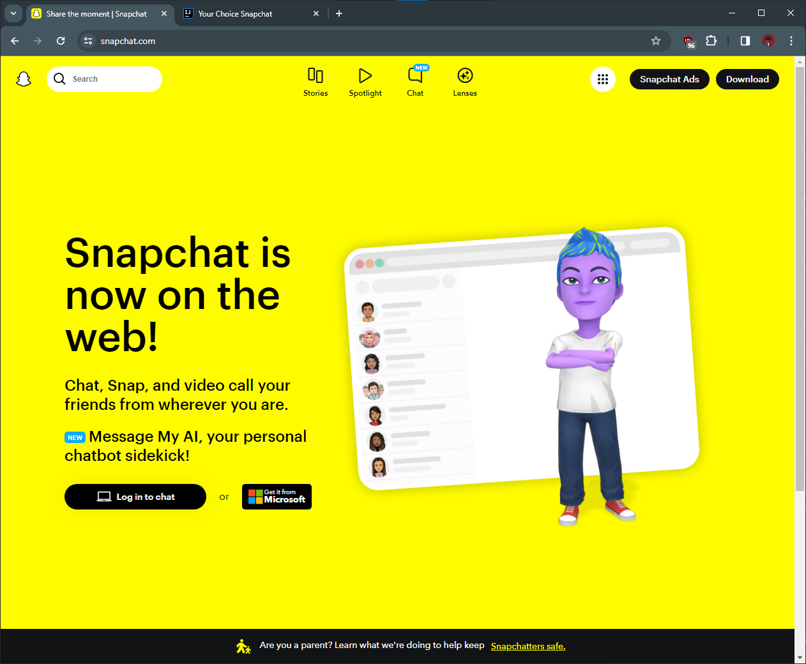
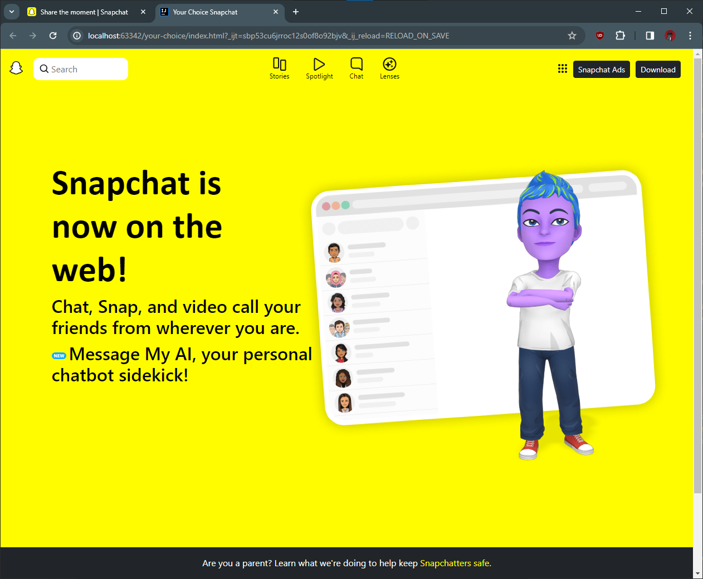

## Introducing Bootstrap 5!

  
  
 

 
I really had no previous experience with UI Frameworks, but I wish I had! Going from Javascript and jumping into Bootstrap 5 was as polarizing as learning a new programming language. You have to shift your entire approach and tackle it in different ways. You can spend hours literally wondering why your image isn't centered and it WILL drive you insane. With Javascript, at least, I ususally understood why my code was wrong. In Bootstrap 5, however, I'd run into situations where I'd feel like my webpage should look a certain way but simply refused to cooperate. I'd eventually remedy the problem, but it was still frustrating nonetheless. 

## It's never as easy as it seems...
It's easy to say "Hey Cash, make a dropdown menu and left align this jpeg," but you will learn the implications of actually doing it. It "should" be easy to center 4-5 icons on a navigation bar and have text under each icon, but sadly we don't live in that world. This is precisely what I had to do for my assignment. You'll see in the images above that I chose to replicate the Snapchat home page, relatively simple in appearance (the left picture). The picture aside it is my replication. In my head, I had an idea of how I'd get through each section. But then I had to figure out how to put icons in my search bar, and figure out how to have my icon not overlap my search bar's text field. THEN I had to figure out why my footer's contents wasn't taking up the width of the webpage. And so on and so on. Instantly, I realized I needed at least another 4 hours to make my Bootstrap replication pixel perfect. I was so focused on troubleshooting my Bootstrap implementation that I missed the assignment deadline (the first assignment I've ever missed), and even after I spent a few more hours working on it to get it to an acceptable state. But once I finally got it all working, it was insanely gratifying. I severely underestimated my basic understanding of Bootstrap, and after this week's WOD I realized I failed to fully grasp Bootstrap and its concepts to an adequate degree. To be honest, I was pretty disapointed in myself, tearing out my hair trying to figure out what I was doing wrong. 

## Concluding Thoughts
It's interesting how I see every website now that I only have a week of experience working with UI frameworks. I may only know how to make a navbar, a footer and import images, but I started to realize how many websites are composed of just these elements and then some. While learning about CSS and HTML is a complicated matter, in a way it demystified what I knew about many of the websites I visit everyday. I have no regrets from this week and am honestly grateful for being able to learn about UI frameworks. This topics I learned this week were genuinely difficult and it made me feel vulnerable, yet the practical knowledge I gained more than makes up for it.
