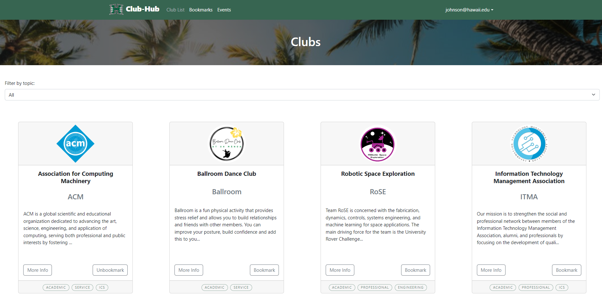

For my class project, I was tasked with 4 other group members to develop a website that could be used by students at the University of Hawaii at Manoa to view clubs on campus. Users could bookmark clubs and keep track of any events that these clubs had. Each club has topics assigned to them and students can use filter clubs by these topics to more easily find clubs that align with their interests. In addition, club officers can easily add and edit events to the clubs they are in charge of and gives them a platform to make announcements to club members. This web application was written using Meteor, Node.js, MongoDB, and React.

One of major contributions to the project includes implementation of the bookmark feature. I had to ensure a bookmark "button" would appear for users, ensure that any related events would show up for users if they chose to bookmark a club, and ensure the application would remember the specific clubs that users had bookmarked. 

Another contribution was acceptance testing of the website and all of its components. Each component and page had to be thoroughly tested via testcafe. These acceptance tests were then incorporated into the main branch on Git, ensuring that each branch update to main would also pass these tests to ensure functionality. 

<pre>

</pre>

