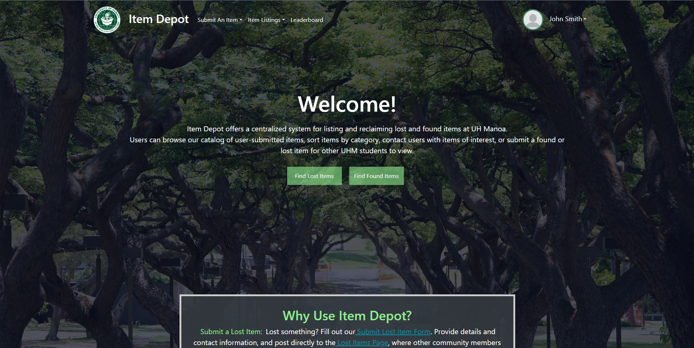
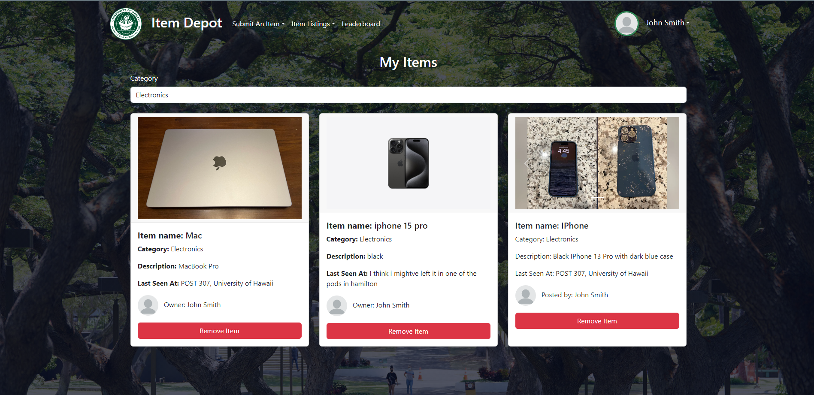
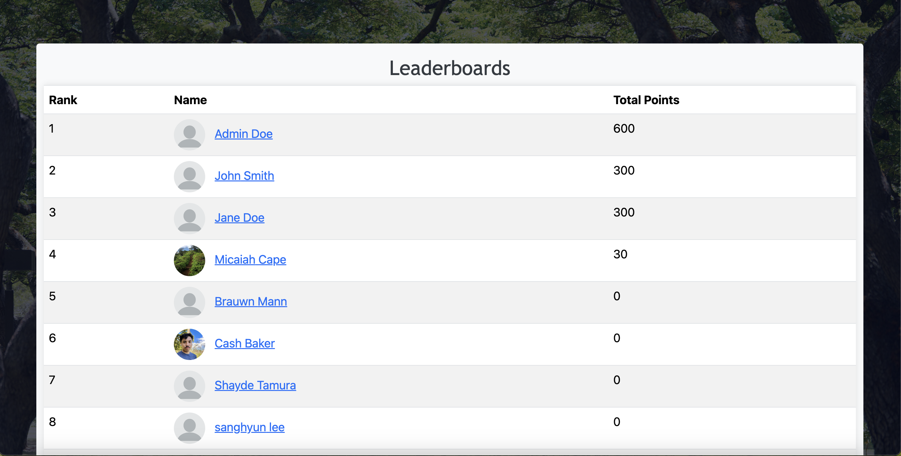

<div class="text-center p-4">
  
  
  
</div>


[Project Repository](https://github.com/item-depot/item-depot) <br>
[GitHub Homepage](https://item-depot.github.io/) 

For our class project, my team of four and I developed 'Item Depot,' a website enhancing UH Manoa's in-person lost and found system. Users could sign up, submit item details, and receive automated email alerts for found items. Item Depot was built with Meteor, Node.js, MongoDB, and React.

Primarily, I handled programming tasks: creating item submission pages, writing item schemas, updating the GitHub homepage, and scheduling meetings. I also implemented features for editing entries and admin controls, along with TestCafe acceptance tests. Below is a snippet testing item addition and display
```
// Asserts that an item can be added and displayed
  async addLostItem(testController) {
    const lostItemTest = { itemName: 'Cinnamoroll', lastSeen: 'Hamilton Library', description: 'a silly lil guy' };
    await testController.typeText('#item-name-field', lostItemTest.itemName);
    
    // Testing image upload functionality
    await testController.setFilesToUpload('#file-input', '../public/images/meteor-logo.png');
    const categorySelect = Selector('#category-field');
    const categoryOption = categorySelect.find('option');
    await testController.click(categorySelect);
    await testController.click(categoryOption.withText('Miscellaneous'));
    await testController.typeText('#last-seen-field', lostItemTest.lastSeen);
    await testController.typeText('#description-field', lostItemTest.description);
    await testController.click('#submit-btn input.btn.btn-primary');
    await testController.click('.swal-button--confirm');
    
    // Check if newly created item is added to lost items page
    await navBar.gotoListLostItemPage(testController);
    await testController.click(Selector('.card-title').withText((lostItemTest.itemName)));
  
```
My final task was creating a point system, which would automatically awarded users points for finding items, and a leaderboard to display the ranking of each user (snippet shown below)

````
/* Renders a table containing all of the Profile documents to display point leaderboard. Use <UserPointsItem> to render each row. */
const ListProfiles = () => {
  // useTracker connects Meteor data to React components. https://guide.meteor.com/react.html#using-withTracker
  const { ready, profiles } = useTracker(() => {
    // Note that this subscription will get cleaned up
    // when your component is unmounted or deps change.
    // Get access to Profiles documents.
    const subscription = Meteor.subscribe(Profiles.userPublicationName);
    // Determine if the subscription is ready
    const rdy = subscription.ready();
    // Get the Profile documents
    const profileItems = Profiles.collection.find({}, { sort: { points: -1 } }).fetch();
    return {
      profiles: profileItems,
      ready: rdy,
    };
  }, []);
````

This project significantly enhanced my software development and collaboration skills, akin to my previous experience with the Club Hub project in 2023. It provided invaluable lessons in taking initiative within a team setting. I also learned how to establish effective coordination strategies, how to maintain regular communication to streamline development, and the importance of setting appropriate goals to meet weekly milestones and deadlines. Working collaboratively on milestones taught me to leverage team strengths and manage workload distribution effectively. Additionally, I gained insights into the process of adding new project features and optimizing code for future scalability.
