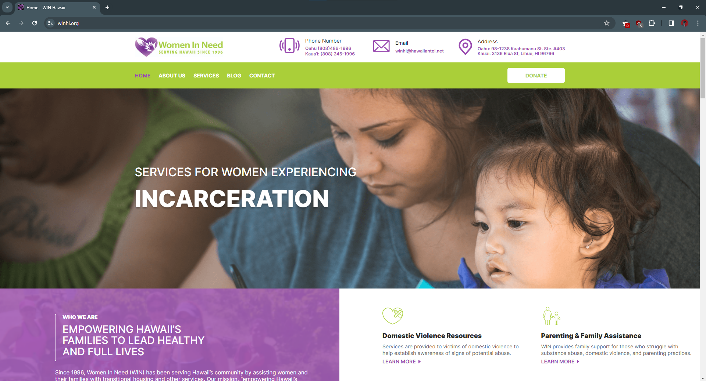

While attending high school, I served as a volunteer editor for Women In Need. WIN was a non-profit organization focused on empowering women who were victims of domestic abuse, homelessness, substance abuse and incarceration. WIN provided counseling and other services to aid in developing postive life skills.

When I joined the organization, I helped write and create newsletters that were emailed out to subscribers of the WIN website. Often, I would be given topics for articles so additional research could be conducted ahead of time, if needed. I would also coordinate with WIN's social media consultant and other members of WIN, to ensure my portion of the newsletter was provided in a timely fashion. 

My time as an editor taught me the value of communication and maintaining transparency when working with other team members, especially when under tight deadlines and ensuring I managed my time effectively between high school and my job as editor.   

<pre>

</pre>

